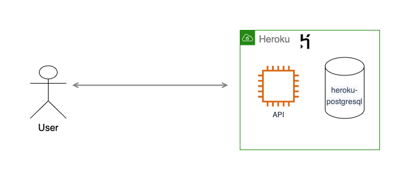

# mutants-analyser-API

Is an API for mutant DNA analysis.

## Prerequisites

* Docker. [Install Docker](https://www.docker.com/get-started)
* Makefile.

## Architecture
The API is developed using go with gin and a PostgreSQL database

The api is deployed on heroku on https://mutants-analyser-api.herokuapp.com

To see the api documentation open in your browser [api-documentation.html](api-documentaion.html)

## Running locally
### Setting database

#### Running Container
Run a container with postgres image using command:

    docker run -d --name=CONTAINER_NAME -p LOCAL_PORT:CONTAINER_PORT -e POSTGRES_PASSWORD=PASS -e PGDATA=/pgdata -v LOCAL_ABSOLUTE_PATH:CONTAINER_ABSOLUTE_PATH postgres
Where
* -d to run detached mode (in background).
* --name for naming the container.
* -p to bind a local port to a container port.
* -e to send enviroment variables.
* -v map a file from local file system to container filesystem.

#### Creating user, database and table
1. Run postgres container.
2. Connect to the database with command: `docker container exec -it CONTAINER_NAME psql -U postgres
`
3. Create a user: `CREATE ROLE USER_NAME PASSWORD 'USER_PASSWORD';`
4. Create database: `CREATE DATABASE DATABASE_NAME OWNER USER_NAME;`
5. Create table, run [schemas.sql](internal/platform/databases/postgres/schemas.sql)

### Run API

After setting up the database and with CWD on the root of the project:
 1. copy [.env](.env) file and asign the variables with your own values.
 2. Go to [config.go](internal/platform/config/config.go) and change the line:
    `return loadConfig(configFilePath, "prod", "env")` changing prod with the prefix you used on your .env file.
    For example if you named it *local.env* instead of "prod" it would be "local".
 3. Run the api: `make run`

## Technical considerations

### Storage

We consider two different approaches for storing the data on a SQL database:

1. Storing only one table with only two columns one for the type *human* or *mutant* and one column for the count.
    The problem of this approach is that if the API is going to add new functionality, like getting all submitted dna,
    it won't be possible because we are only storing the count of each analysis result. But it is the most 
    memory and time effective approach. 

2. Storing each dna submitted and then when the stats are calculated, sum the amount of each type.
   This is the chosen approach because it says on the task that we need to save one register per DNA and it also will be able to scale,
    but it requires more memory and more time for each request.
   

### Analyser

For the analyser we implemented two types of analyser.
One allowing chains overlapping on the same direction and one that ignores them.
If we allow overlapping on same direction, any dna sequence containing a chain with at least five same nucleotides aligned on the same direction will be consider a mutant.
We can build two chains the one starting on the first nucleotide and ending in the fourth, and one starting on the second and ending on the fifth.
Also when we ignore chains overlapping on the same direction, we allow overlapping on different directions.
When you create the analyser you need to provide a boolean indicating if the analyser will consider or ignore chains overlapping on the same direction.

### Stats

When calculating mutant ratio, in the case of containing only mutants registers the ratio would be the quantity of mutants registered instead of infinity or error.